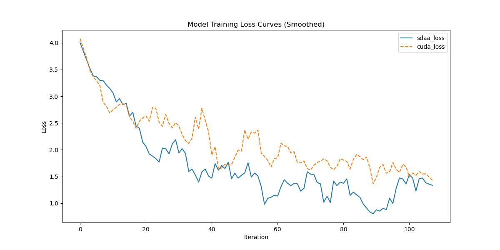

# ANN

## 1. 模型概述

**Asymmetric Non-local Neural Network (ANN)** 是由华中科技大学 Bai Xiang 团队提出的一种针对语义分割任务优化的深度神经网络结构，旨在有效捕获图像中远距离像素之间的依赖关系，同时减少传统非局部模块中高昂的计算开销与显存占用。

ANN 引入了两个关键模块：

* **Asymmetric Pyramid Non-local Block (APNB)**：将金字塔采样机制引入非对称结构，有效降低计算与内存消耗。
* **Asymmetric Fusion Non-local Block (AFNB)**：进一步利用多层特征融合，增强上下文感知能力。

在 Cityscapes、ADE20K、Pascal VOC 等数据集上表现优异，成为轻量级与高精度兼顾的代表模型之一。

* 论文链接：[\[1908.07678\]](https://arxiv.org/abs/1908.07678) Asymmetric Non-local Neural Networks for Semantic Segmentation
* 仓库链接：[https://github.com/MendelXu/ANN](https://github.com/MendelXu/ANN)
* MMSeg实现：[https://github.com/open-mmlab/mmsegmentation/blob/main/configs/ann/](https://github.com/open-mmlab/mmsegmentation/blob/main/configs/ann/)


## 2. 快速开始
使用本模型执行训练的主要流程如下：
1. 基础环境安装：介绍训练前需要完成的基础环境检查和安装。
2. 获取数据集：介绍如何获取训练所需的数据集。
3. 构建环境：介绍如何构建模型运行所需要的环境。
4. 启动训练：介绍如何运行训练。

### 2.1 基础环境安装

请参考基础环境安装章节，完成训练前的基础环境检查和安装。

### 2.2 准备数据集
#### 2.2.1 获取数据集
Ann 使用 CityScape 数据集，该数据集为开源数据集，可从 [CityScape](https://www.cityscapes-dataset.com) 下载。


### 2.3 构建环境

所使用的环境下已经包含PyTorch框架虚拟环境。
1. 执行以下命令，启动虚拟环境。
    ```
    conda activate torch_env
    ```
2. 安装python依赖。
    ```
    pip3 install  -U openmim 
    pip3 install git+https://gitee.com/xiwei777/mmengine_sdaa.git 
    pip3 install opencv_python mmcv --no-deps
    mim install -e .
    pip install -r requirements.txt

    ```

### 2.4 启动训练

1. 在构建好的环境中，进入训练脚本所在目录。
  ```
  cd <ModelZoo_path>/PyTorch/contrib/Segmentation/ann/run_scripts
  ```

2. 运行训练。该模型支持单机单卡。
  ```
  python run_ann.py --config ../configs/ann/ann_r50-d8_4xb2-40k_cityscapes-512x1024.py \
    --launcher pytorch --nproc-per-node 4 --amp \
    --cfg-options "train_dataloader.dataset.data_root=$data_path" "val_dataloader.dataset.data_root=$data_path"
  ```
    更多训练参数参考 run_scripts/argument.py

### 2.5 训练结果
输出训练loss曲线及结果（参考使用[loss.py](./run_scripts/loss.py)）: 



MeanRelativeError: -0.22970206904250673
MeanAbsoluteError: -0.4743536502122879
Rule,mean_absolute_error -0.4743536502122879
pass mean_relative_error=-0.22970206904250673 <= 0.05 or mean_absolute_error=-0.4743536502122879 <= 0.0002