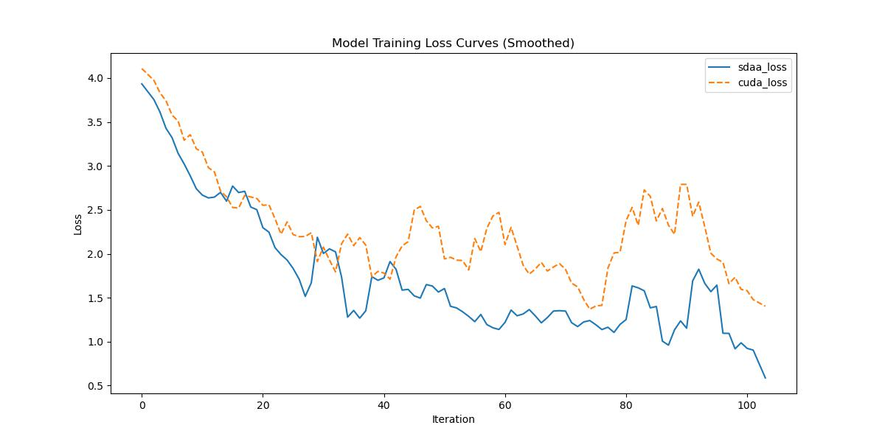

# CCNET

## 1. 模型概述
 [CCNet: Criss-Cross Attention for Semantic Segmentation](https://arxiv.org/abs/1811.11721)
🔗 [官方代码仓库](https://github.com/speedinghzl/CCNet)
🔎 [代码片段（mmsegmentation 实现）](https://github.com/open-mmlab/mmsegmentation/blob/v0.17.0/mmseg/models/decode_heads/apc_head.py#L111)

上下文信息在诸如语义分割和目标检测等视觉理解问题中至关重要。我们提出了一种高效获取整图上下文信息的方法——**Criss-Cross Network（CCNet）**。

具体来说，我们引入了一种新颖的**交叉注意力模块（Criss-Cross Attention Module）**，它能够为每个像素收集其所在“十字路径”上所有像素的上下文信息。通过进一步的**循环操作（Recurrent Operation）**，每个像素最终可以获得整个图像范围内的依赖信息。

此外，我们还提出了一种**类别一致性损失（Category Consistent Loss）**，用于增强交叉注意力模块提取的特征的判别能力。

总体而言，CCNet 具有以下优势：

1. **GPU 内存友好**：相比非局部模块（Non-local Block），所提出的循环交叉注意力模块可节省约 11 倍的 GPU 内存使用；
2. **计算效率高**：循环交叉注意力模块将非局部模块的浮点运算量（FLOPs）减少约 85%；
3. **性能领先**：我们在多个语义分割基准数据集上进行了大量实验，包括 Cityscapes、ADE20K、人像解析数据集 LIP、实例分割数据集 COCO、视频分割数据集 CamVid。

## 2. 快速开始
使用本模型执行训练的主要流程如下：
1. 基础环境安装：介绍训练前需要完成的基础环境检查和安装。
2. 获取数据集：介绍如何获取训练所需的数据集。
3. 构建环境：介绍如何构建模型运行所需要的环境。
4. 启动训练：介绍如何运行训练。

### 2.1 基础环境安装

请参考基础环境安装章节，完成训练前的基础环境检查和安装。

### 2.2 准备数据集
#### 2.2.1 获取数据集
ccnet 使用 CityScapes 数据集，该数据集为开源数据集，可从 [CityScapes](https://www.cityscapes-dataset.com) 下载。


### 2.3 构建环境

所使用的环境下已经包含PyTorch框架虚拟环境。
1. 执行以下命令，启动虚拟环境。
    ```
    conda activate torch_env
    ```
2. 安装python依赖。
    ```
    pip3 install  -U openmim 
    pip3 install git+https://gitee.com/xiwei777/mmengine_sdaa.git 
    pip3 install opencv_python mmcv --no-deps
    mim install -e .
    pip install -r requirements.txt

    ```

### 2.4 启动训练

1. 在构建好的环境中，进入训练脚本所在目录。
  ```
  cd <ModelZoo_path>/PyTorch/contrib/Segmentation/ann/run_scripts
  ```

2. 运行训练。该模型支持单机单卡。
```
python run_ccnet.py --config ../configs/ccnet/ccnet_r50-d8_4xb2-40k_cityscapes-512x1024.py \
    --launcher pytorch --nproc-per-node 4 --amp \
    --cfg-options "train_dataloader.dataset.data_root=$data_path" "val_dataloader.dataset.data_root=$data_path" 2>&1 | tee sdaa.log
```
更多训练参数参考 run_scripts/argument.py

### 2.5 训练结果
输出训练loss曲线及结果（参考使用[loss.py](./run_scripts/loss.py)）: 



MeanRelativeError: -0.2982997567927939
MeanAbsoluteError: -0.7589329922199249
Rule,mean_absolute_error -0.7589329922199249
pass mean_relative_error=np.float64(-0.2982997567927939) <= 0.05 or mean_absolute_error=np.float64(-0.7589329922199249) <= 0.0002