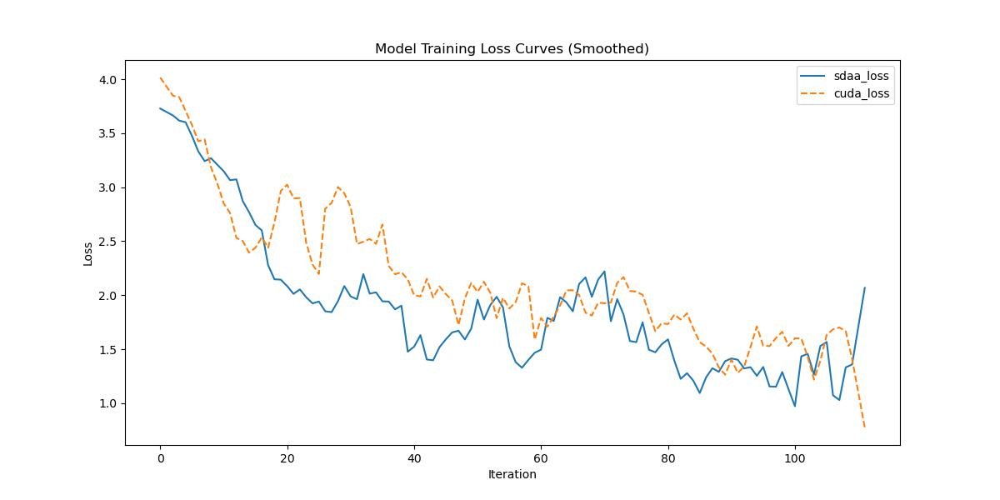

# EMANet
## 1. 模型概述

> [Expectation-Maximization Attention Networks for Semantic Segmentation](https://arxiv.org/abs/1907.13426)

## 简介

<a href="https://xialipku.github.io/EMANet">官方项目页面</a>  
<a href="https://github.com/open-mmlab/mmsegmentation/blob/v0.17.0/mmseg/models/decode_heads/ema_head.py#L80">代码片段</a>

## 摘要

自注意力机制被广泛应用于各种任务中，通过对所有位置的特征加权求和来计算每个位置的表示，从而捕捉长距离依赖关系。然而，该机制的计算开销很大，因为注意力图需要针对所有位置进行计算。

本文将注意力机制重新建模为一种期望最大化（EM）过程，通过迭代估计一个更紧凑的基集合，并在该集合上计算注意力图。通过对这些基进行加权求和，得到的表示具有低秩特性，有效抑制输入中的噪声信息。

所提出的期望最大化注意力模块（EMA）对输入变化具有鲁棒性，且内存与计算开销较低。同时我们引入了基的维护与归一化方法以稳定训练过程。

我们在 PASCAL VOC、PASCAL Context 和 COCO Stuff 等主流语义分割数据集上进行了大量实验，并取得了新的最优结果。

## 2. 快速开始
使用本模型执行训练的主要流程如下：
1. 基础环境安装：介绍训练前需要完成的基础环境检查和安装。
2. 获取数据集：介绍如何获取训练所需的数据集。
3. 构建环境：介绍如何构建模型运行所需要的环境。
4. 启动训练：介绍如何运行训练。

### 2.1 基础环境安装

请参考基础环境安装章节，完成训练前的基础环境检查和安装。

### 2.2 准备数据集
#### 2.2.1 获取数据集
emanet 使用 Cityscapes 数据集，该数据集为开源数据集，可从 [Cityscapes](https://www.cityscapes-dataset.com) 下载。


### 2.3 构建环境

所使用的环境下已经包含PyTorch框架虚拟环境。
1. 执行以下命令，启动虚拟环境。
    ```
    conda activate torch_env
    ```
2. 安装python依赖。
    ```
    pip3 install  -U openmim 
    pip3 install git+https://gitee.com/xiwei777/mmengine_sdaa.git 
    pip3 install opencv_python mmcv --no-deps
    mim install -e .
    pip install -r requirements.txt

    ```

### 2.4 启动训练

1. 在构建好的环境中，进入训练脚本所在目录。
  ```
  cd <ModelZoo_path>/PyTorch/contrib/Segmentation/emanet/run_scripts
  ```

2. 运行训练。该模型支持单机单卡。
```
python run_ccnet.py --config ../configs/emanet/emanet_r50-d8_4xb2-80k_cityscapes-512x1024.py \
    --launcher pytorch --nproc-per-node 4 --amp \
    --cfg-options "train_dataloader.dataset.data_root=$data_path" "val_dataloader.dataset.data_root=$data_path" 2>&1 | tee sdaa.log
```
更多训练参数参考 run_scripts/argument.py

### 2.5 训练结果
输出训练loss曲线及结果（参考使用[loss.py](./run_scripts/loss.py)）: 


MeanRelativeError: -0.043414843661227415
MeanAbsoluteError: -0.16929115176200868
Rule,mean_absolute_error -0.16929115176200868
pass mean_relative_error=np.float64(-0.043414843661227415) <= 0.05 or mean_absolute_error=np.float64(-0.16929115176200868) <= 0.0002