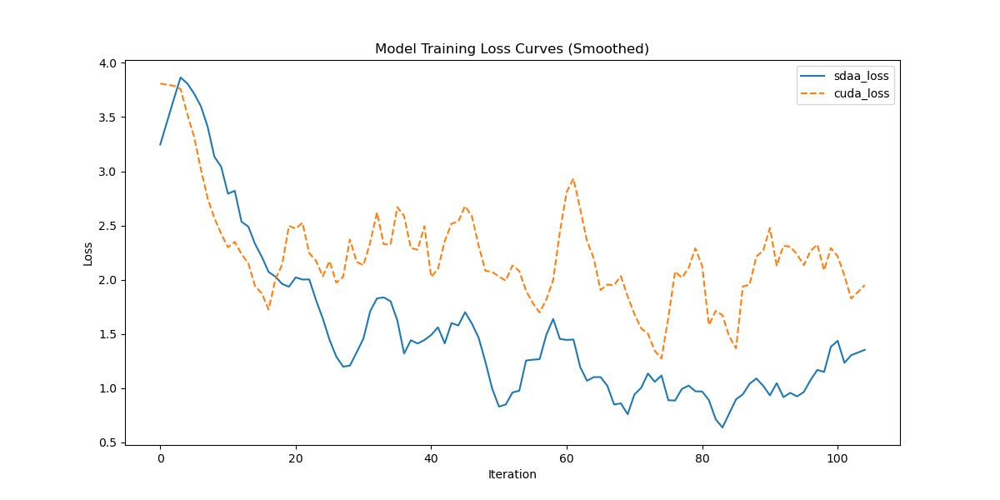

# OCRNet
## 1. 模型概述

> [Object-Contextual Representations for Semantic Segmentation](https://arxiv.org/abs/1909.11065)

## 简介

<a href="https://github.com/openseg-group/OCNet.pytorch">官方项目仓库</a>  
<a href="https://github.com/open-mmlab/mmsegmentation/blob/v0.17.0/mmseg/models/decode_heads/ocr_head.py#L86">代码片段</a>

## 摘要

本文聚焦于语义分割中的上下文聚合策略，提出了一种简单而有效的方法：**对象上下文表示（Object-Contextual Representations）**。我们的动机是：一个像素的类别应取决于其所属的物体类别。

首先，我们基于由真实标签监督的特征图构建对象区域，并计算其表示。然后，我们计算每个像素与各对象区域之间的表示相似度，并根据这些相似度对所有对象区域的表示进行加权汇聚，从而增强像素表示。

我们在 Cityscapes、ADE20K、LIP、PASCAL VOC 2012、PASCAL-Context 和 COCO-Stuff 六个具有挑战性的语义分割数据集上进行了实证研究，验证了该方法的有效性。其中，在 Cityscapes 排行榜上，我们使用单模型取得了第 2 名的优异成绩。


## 2. 快速开始
使用本模型执行训练的主要流程如下：
1. 基础环境安装：介绍训练前需要完成的基础环境检查和安装。
2. 获取数据集：介绍如何获取训练所需的数据集。
3. 构建环境：介绍如何构建模型运行所需要的环境。
4. 启动训练：介绍如何运行训练。

### 2.1 基础环境安装

请参考基础环境安装章节，完成训练前的基础环境检查和安装。

### 2.2 准备数据集
#### 2.2.1 获取数据集
ocrnet 使用 Cityscapes 数据集，该数据集为开源数据集，可从 [Cityscapes](https://www.cityscapes-dataset.com) 下载。


### 2.3 构建环境

所使用的环境下已经包含PyTorch框架虚拟环境。
1. 执行以下命令，启动虚拟环境。
    ```
    conda activate torch_env
    ```
2. 安装python依赖。
    ```
    pip3 install  -U openmim 
    pip3 install git+https://gitee.com/xiwei777/mmengine_sdaa.git 
    pip3 install opencv_python mmcv --no-deps
    mim install -e .
    pip install -r requirements.txt

    ```

### 2.4 启动训练

1. 在构建好的环境中，进入训练脚本所在目录。
  ```
  cd <ModelZoo_path>/PyTorch/contrib/Segmentation/ocrnet/run_scripts
  ```

2. 运行训练。该模型支持单机单卡。
```
python run_ccnet.py --config ../configs/ocrnet/ocrnet_hr18_4xb2-40k_cityscapes-512x1024.py \
    --launcher pytorch --nproc-per-node 4 --amp \
    --cfg-options "train_dataloader.dataset.data_root=$data_path" "val_dataloader.dataset.data_root=$data_path" 2>&1 | tee sdaa.log
```
更多训练参数参考 run_scripts/argument.py

### 2.5 训练结果
输出训练loss曲线及结果（参考使用[loss.py](./run_scripts/loss.py)）: 



MeanRelativeError: -0.39036839347761293
MeanAbsoluteError: -0.9266193532943725
Rule,mean_absolute_error -0.9266193532943725
pass mean_relative_error=np.float64(-0.39036839347761293) <= 0.05 or mean_absolute_error=np.float64(-0.9266193532943725) <= 0.0002